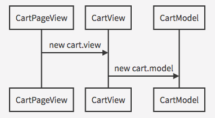
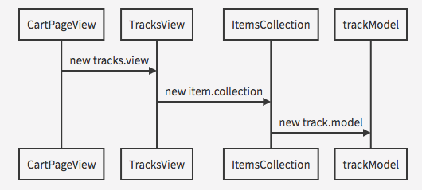
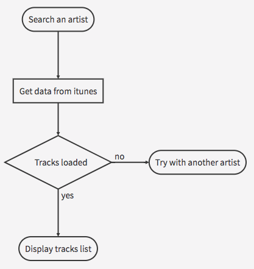
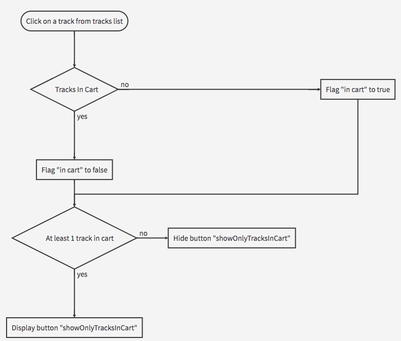

# Itunes Music Search BB demo

### Build setup

``` bash
# install dependencies
npm install

# serve with hot reload at localhost:8080
npm start

# run unit tests
npm test

# run unit test in dev mode
npm test-dev
```

---

### Technologies

* [Javascript (ES6)](https://developer.mozilla.org/fr/docs/Web/JavaScript) => main language
* [TypeScript](https://www.typescriptlang.org/index.html) => wanted to try :)
* [Backbone](http://backbonejs.org) => architecture
* [Webpack](https://webpack.js.org) => bundles, devops
* [Jest](https://facebook.github.io/jest) => Testing
* [style-loader](https://github.com/webpack-contrib/style-loader) => webpack module for CSS
* [handlebars](http://handlebarsjs.com/) => Templates JS
* [Material Design Lite](https://getmdl.io/) => Templating components

---

### Architecture

The architecture is more or less dictated by the *backbone* framework, models map API data, collections are lists of models, and views (view-controller in fact) display information in the browser.

I tried to follow some rules in order to create an app as close as possible from a component based architecture. The main vue is rendered once only and is composed of multiple subviews which will be reloaded when needed (using the function `renderSubview()` coded in the file `base.view`).

The two components used are `tracks.view`, which will display a collection of tracks (from the search request results and for selected tracks in the cart) and `cart.view` which is a simple summary for the cart with some actions buttons.


#### Sequence chart

######  *Cart page view initialization with cart view*



######  *Cart page view initialization with tracks view*



---

#### Flow chart

######  *Search artist*



######  *Add/remove to cart*



---

### Way of improvements

* Using [JavaScript Documentation Generator](https://www.fusioncharts.com/blog/jsdoc-vs-yuidoc-vs-doxx-vs-docco-choosing-a-javascript-documentation-generator/)
* Using a CSS preprocessor as Stylus or SASS or LESS for more complex template theming
* Creating a new collection for tracks list in cart, in order to add tracks from multiple search
* Increasing test coverage by adding e2e tests and increased number of unit tests
* Using a code coverage tool like [istanbulJS](https://istanbul.js.org/)
* Improving cart (always visible during navigation, think about a way to go back in a previous state)
* Working with a team (cause nobody's perfect and I don't know all the way of improvement :)

Even with all these improvements, "backbone" is an aging framework. Concepts are good (models, collection, etc...) but based on the MVC architecture which don't give a lot of flexibilities whenever you try to create components.

At my side, I would prefer create models, collections, stores using pure javascript in order to be less "framework dependant". It's easier to maintain and would give us less work in case of framework switch.

Some others framework, like VueJS, could be more interesting (easier to understand, to code, easier to integrate, easier to create component, less dependencies, component based architecture)

